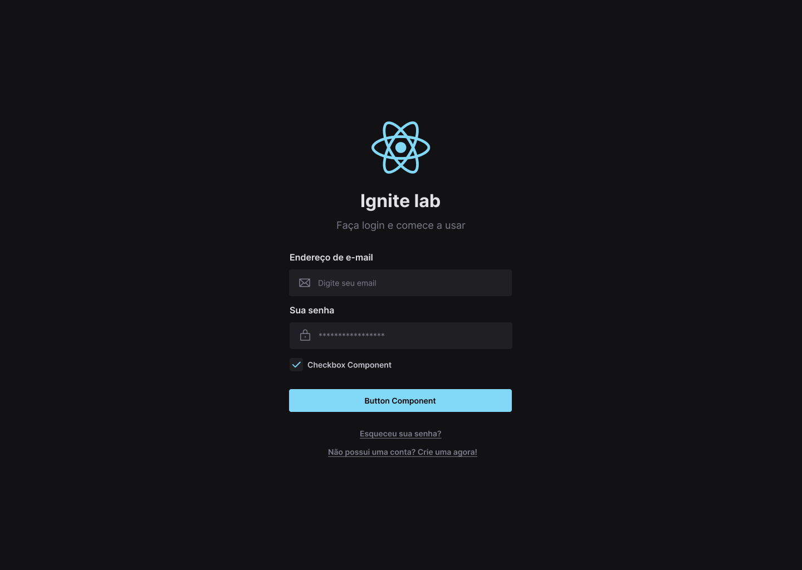
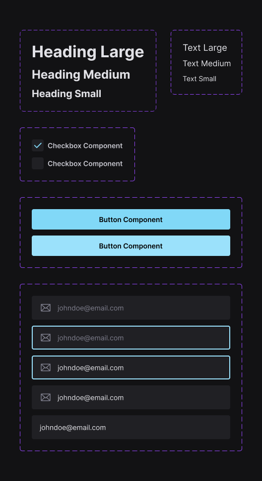

# Ignite Lab Design System

## 📝 Projeto

Objetivo desse projeto é iniciar um novo aprendizado na criação de um design system com figma e teste de componentes com storybook.

- 
- 

## 🛠 Tecnologias

- [Storybook](https://storybook.js.org/)
- [Vitejs](https://vitejs.dev/)
- [React](https://pt-br.reactjs.org/)

## 🧠 Aprendizados

- Teste de componentes isolados com Storybook

## ⚙ Execução

```
Node.js - lts - 16.17v
NPM - 8.11v
```

```bash
#Terminal
$ git clone https://github.com/DenisMedeirosSDK/ignite-lab-design-system.git

$ cd ignite-lab-design-system

$ npm run install

$ npm run storybook
#http://localhost:6006

$ npm run dev
#http://localhost:5173
```

**_Data: 10/10/22 á 13/10/22_**
